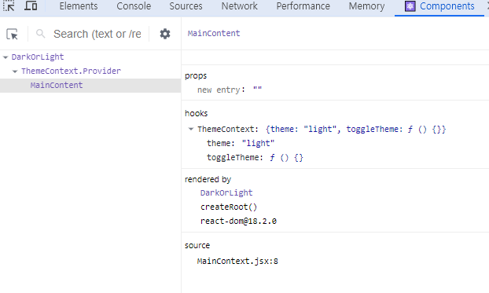

# Getting Started with Create React App

This project was bootstrapped with [Create React App](https://github.com/facebook/create-react-app).

## Available Scripts

In the project directory, you can run:

### `npm start`

Runs the app in the development mode.\
Open [http://localhost:3000](http://localhost:3000) to view it in your browser.

The page will reload when you make changes.\
You may also see any lint errors in the console.

### `npm test`

Launches the test runner in the interactive watch mode.\
See the section about [running tests](https://facebook.github.io/create-react-app/docs/running-tests) for more information.

### `npm run build`

Builds the app for production to the `build` folder.\
It correctly bundles React in production mode and optimizes the build for the best performance.

The build is minified and the filenames include the hashes.\
Your app is ready to be deployed!

See the section about [deployment](https://facebook.github.io/create-react-app/docs/deployment) for more information.

### `npm run eject`

**Note: this is a one-way operation. Once you `eject`, you can't go back!**

If you aren't satisfied with the build tool and configuration choices, you can `eject` at any time. This command will remove the single build dependency from your project.

Instead, it will copy all the configuration files and the transitive dependencies (webpack, Babel, ESLint, etc) right into your project so you have full control over them. All of the commands except `eject` will still work, but they will point to the copied scripts so you can tweak them. At this point you're on your own.

You don't have to ever use `eject`. The curated feature set is suitable for small and middle deployments, and you shouldn't feel obligated to use this feature. However we understand that this tool wouldn't be useful if you couldn't customize it when you are ready for it.

## Learn More

You can learn more in the [Create React App documentation](https://facebook.github.io/create-react-app/docs/getting-started).

To learn React, check out the [React documentation](https://reactjs.org/).

### Code Splitting

This section has moved here: [https://facebook.github.io/create-react-app/docs/code-splitting](https://facebook.github.io/create-react-app/docs/code-splitting)

### Analyzing the Bundle Size

This section has moved here: [https://facebook.github.io/create-react-app/docs/analyzing-the-bundle-size](https://facebook.github.io/create-react-app/docs/analyzing-the-bundle-size)

### Making a Progressive Web App

This section has moved here: [https://facebook.github.io/create-react-app/docs/making-a-progressive-web-app](https://facebook.github.io/create-react-app/docs/making-a-progressive-web-app)

### Advanced Configuration

This section has moved here: [https://facebook.github.io/create-react-app/docs/advanced-configuration](https://facebook.github.io/create-react-app/docs/advanced-configuration)

### Deployment

This section has moved here: [https://facebook.github.io/create-react-app/docs/deployment](https://facebook.github.io/create-react-app/docs/deployment)

### `npm run build` fails to minify

This section has moved here: [https://facebook.github.io/create-react-app/docs/troubleshooting#npm-run-build-fails-to-minify](https://facebook.github.io/create-react-app/docs/troubleshooting#npm-run-build-fails-to-minify)


***
[처음만난 리액트](https://github.com/soaple/first-met-react-practice-v18) 강의를 들으면서 메모한 내용입니다.
***
</br>

# node 설치
- node 설치 시 npm이 함께 설치된다

## 설치된 node, npm 버전 확인

```cmd
> node -- version
> npm -- version
```

# create-react-app

- create-react-app 명령어 실행 시 오류가 발생하여 리액트 제거 후 재설치 진행함

```cmd
> npm uninstall -g create-react-app
> npm install -g create-react-app
```

## create-react-app

```cmd
> npx create-react-app [app-name]
> npx create-react-app my-app
```

## 실행

```cmd
> cd my-app
> npm start
```

# JSX
- chapter_03 참고

- JSX 는 자바스크립트와 XML, HTML 을 합친 것
- JSX 는 내부적으로 XML, HTML 코드를 JavaScript 로 변환하는 과정을 거침
- React.createElement : JSX 코드를 JavaScript 로 변환하는 역할, (자바스크립트 객체를 만드는 역할)
- JSX 를 사용하면 코드가 간결해진다.

```javascript
React.createElement(
    type, // 타입
    [props], // 더 자세히 배우기 전까지는 element 의 속성이라고 생각하자 실제로는 attribute 보다 좀 더 상위에 있는 개념이지만...
    [...children] // 엘리먼트의 자식 엘리먼트들
    );
```

```JSX
// JSX 사용한 코드
// 내부적으로는 React.createElement() 함수를 사용하게 되어있고 그 결과로 JavaScript 로 변환됨
const element = (
    <h1 className="greeting">
        Hello, world!
    </h1>
)

// JSX를 사용하지 않은 코드
const element = React.createElement(
  "h1",
  { className: "greeting" },
  "Hello, world!"
);

// 위 React.createElement()의 결과로 아래의 객체 생성
const element = {
    type: 'h1',
    props: {
        className : 'greeting',
        children : 'Hello, world!'
    }
}
```

# Elements
## 엘리먼트란
- 자바스크립트 객체 형태로 존재
- 컴포넌트 유형과 속성 및 내부의 모든 자식에 대한 정보를 포함하고 있는 일반적인 자바스크립트 객체


```javascript
// type 에 html 태그 이름이 문자열로 들어가는 경우
{
    type: 'button',
    props : {
        className : 'bg-green',
        children : {
            type: 'b',
            props : {
                children : 'Hello, element!'
            }
        }
    }
}

// 렌더링 후
<button class='bg-green'>
   <b>
      Hello, element!
   </b>
</button>

// type 에 html 태그 이름이 문자열이 아닌 리액트 컴포넌트 이름일 때
// (모든 React 컴포넌트는 최종적으로 HTML 태그를 사용하게 되어있다)
{
    type : Button,
    props: {
        color : 'green',
        children : 'Hello, element!'
    }
}

//
```

```javascript
function Button(props) {
    return (
        <button className={`bg-${props.color}`}>
           <b>
               {props.children}
           </b>
        <button> 
    )
}

// confirmDialog 컴포넌트가 Button 컴포넌트를 포함하고 있다
function ConfirmDialog(props) {
    return (
        <div>
           <p>내용을 확인하셨으면 확인 버튼을 눌러주세요.</p>
           <Button color='green'>확인</Button>
        </div>
    )
}

// 렌더링 후 객체
{
    type: 'div',
    props: {
        children : [
            {
                type : 'p',
                props : {
                    children : '내용을 확인하셨으면 확인 버튼을 눌러주세요.'
                }
            },
            {
                type : Button, // 타입이 HTML 태그가 아닌 React 컴포넌트 이름, React 는 버튼 컴포넌트의 엘리먼트를 생성해서 합치게 된다
                props : {
                    color : 'green',
                    children : '확인'
                }
            }
        ]
    }
}

// 렌더링 후 최종적인 객체
// 모든 컴포넌트가 CreateElement 함수를 통해 Element 로 변환된다
{
    type: 'div',
    props: {
        children : [
            {
                type : 'p',
                props : {
                    children : '내용을 확인하셨으면 확인 버튼을 눌러주세요.'
                }
            },
            {
                type : 'button', 
                props : {
                    className : 'bg-green',
                    children : {
                        type : 'b',
                        props : {
                            children : '확인'
                        }
                    }
                }
            }
        ]
    }
}
```
## 엘리먼트의 불변성 immutable
- Elements 생성 후에는 children 이나 attributes를 바꿀 수 없다
- 화면에 변경된 엘리먼트를 보여주기 위해서는 새로운 엘리먼트를 만들면 된다. 리액트는 빠른 랜더링이 장점이므로 만들어서 바꾸면 된다.
- Virtual DOM 에서 변경된 부분을 계산(Compute Diff), 컴퓨트 딥 하고 해당 부분만 다시 랜더링

### Elements 렌더링

- chapter_04 참고

```javascript
// 루트 div 에 리액트 엘리먼트 렌더링 - virtual dom 에서 실제 브라우저 dom 으로 이동하는 과정
const element = <h1>안녕, 리액트!</h1>; // React 엘리먼트 생성. React 엘리먼트는 React 의 Virtual DOM 에 존재하는 것
ReactDOM.render(element, document.getElementById('root')); // 생성된 리액트 엘리먼트를 루트 div (=DOM 엘리먼트)에 렌더링,  DOM 엘리먼트는 실제 브라우저의 DOM 에 존재하는 것
```

```javascript
function tick() {
    const element = (
        <div>
             <h1>안녕, 리액트!</h1>
             <h2>현재 시간: {new Date().toLocaleTimeString()}</h2>
        </div>
    );

    ReactDOM.render(element, document.getElementById('root'));
}

setInterval(tick, 1000);
```

# Components 와 Props
- chapter_05 참고
- props : 리액트 컴포넌트에서의 입력, 컴포넌트에 전달할 다양한 정보를 담고 있는 자바스크립트 객체
- props---(입력)--- [React component] ---(출력)--- elements
- 모든 리액트 컴포넌트는 props 에 관해 pure 함수같은 역할을 해야한다 
- 모든 리액트 컴포넌트는 Props 를 직접 바꿀 수 없고, 같은 Props 에 대해서는 항상 같은 결과를 보여줄 것
- 컴포넌트의 이름은 항상 대문자로 시작해야 한다. 리액트는 소문자로 시작하는 컴포넌트를 DOM 태그로 인식함

```javascript
// 함수가 pure 하다. props a 와 b 값을 바꾸지 않으므로
function sum(a, b) {
    return a + b;
}

// 함수가 impure 하다. 입력값으로 받은 account 의 값을 변경했으므로
function withdraw(account, amount) {
    account.total -= amount;
}
```

- Props 전달하는 방법 예
```javascript
// JSX 사용
function App(props) {
    return (
        <Profile
            name="홍길동"
            introduction="안녕하새요, 홍길동입니다."
            viewCount={1500}
        />
    );
}

// JSX 를 사용하지 않을 때
React.createElement(
    type,
    [props],
    [...children]
)
React.createElement(
    Profile, // type
    { // props
        name: "홍길동",
        introduction: "안녕하세요, 홍길동입니다.",
        viewCount : 1500
    },
    null // children
)
```

## Component 종류
- Function Component 함수 컴포넌트와 Class Component 클래스 컴포넌트로 나뉜다

- Class Component
    - 리액트의 모든 클래스 컴포넌트는 React.Component 를 상속받아서 만든다.

</br>

  |**<center>Function Component</center>**|**<center>Class Component</center>**|
  |:---|:---|
  |state 사용 불가| 생성자에서 state를 정의|
  |Lifecycle에 따른 기능 구현 불가| setState() 함수를 통해 state 업데이트 |
  |**Hooks** 을 사용하여 클래스 컴포넌트 기능 구현|Lifecycle methods 제공|


```javascript
class Welcome extends React.Component {
    render() {
        return <h1>안녕, {this.props.name}</h1>;
    }
}
```

# State 와 Lifecycle
- State : 리액트 컴포넌트의 변경 가능한 데이터
- 렌더링이나 데이터 흐름에 사용되는 값만 state 에 포함시켜야 하고, 그렇지 않은 값은 컴포넌트의 인스턴스 필드로 정의한다
- state 가 변경될 경우 컴포넌트가 다시 렌더링되기 때문에 렌더링과 데이터 흐름에 관련된 없는 값을 포함하면 불필요한 경우에 컴포넌트가 다시 렌더링 되어 성능을 저하시킬 수 있다

```javascript
class LikeButton extends React.Component {
    constructor(props) { // 클래스 컴포넌트는 state 를 생성자에서 정의. 함수 컴포넌트는 state 를 useState 라는 hook을 사용해서 정의
        super(props);

        this.state = { // 현재  컴포넌트의 state 를 정의하는 부분
            liked: false
        }
    }
}
```
- state 는 직접 수정할 수 없다(하면 안된다)
```javascript
// state 를 직접 수정 (잘못된 사용법)
this.state = {
    name: '홍길동'
};

// setState 함수를 통한 수정 (정상적인 사용법)
this.setState({
    name: '홍길동'
});
```

## 컴포넌트의 생명주기
- chapter_06 참고
- Mounting : 컴포넌트의 생성자가 실행되고 생성자에서는 컴포넌트의 state 를 정의, 컴포넌트가 렌더링되며 이후에 componentDidMount 함수가 호출된다
- Updating : state 가 변경되거나 falseUpdate 라는 강제 업데이트 함수 호출로 인해 컴포넌트가 다시 렌더링
- Unmounting : 상위 컴포넌트에서 현재 컴포넌트를 더 이상 화면에 표시하지 않게 될 때 Unmount 발생하며 Unmount 직전에 componentWillUnmount 함수가 호출된다


# Hook
- chapter_07 참고
Hook 을 사용하면 함수 컴포넌트에서도 클래스 컴포넌트와 같은 기능을 구현 할 수 있다
 |**<center>Function Component</center>**|**<center>Class Component</center>**|
  |:---|:---|
  |state 사용 불가| 생성자에서 state를 정의|
  |Lifecycle에 따른 기능 구현 불가| setState() 함수를 통해 state 업데이트 |
  |**Hooks** 을 사용하여 클래스 컴포넌트 기능 구현|Lifecycle methods 제공|

Hook 의 이름은 모두 use로 시작

## useState()
- 대표적이고 가장 많이 사용되는 Hook
- state 를 사용하기 위한 hook
```javascript
const [변수명, set함수명] = useState(초기값);
```
```javascript
import React, {useState} from "react";
function Counter(props) {
    // 클래스 컴포넌트에서는 setState 함수 하나를 사용해서 모든 state 값을 업데이트 할 수 있었지만
    // useState 를 사용하는 방법에서는 변수 각각에 대해 set함수가 따로 존재한다.
    const [count, setCount] = useState(0);

    return (
        <div>
            <p>총 {count}번 클릭했습니다.</p>
            <button onClick={() => setCount(count + 1)}>
                클릭
            </button>
        </div>
    );
}
```

## useEffect()
- 사이드 이펙트를 수행하기 위한 훅
- 사이드 이펙트 : 서버에서 데이터를 받아오거나 수동으로 DOM 을 변경하는 작업 등 다른 컴포넌트에 영향을 미칠 수 있는 작업으로 렌더링 중 작업이 완료될 수 없고 렌더링 끝난 이후에 실행되어야 함. 이러한 작업이 사이드로 실행된다는 의미에서 사이드 이펙트라고 불리며 
- useEffect는 함수 컴포넌트에서 사이드 이펙트를 실행할 수 있게 해주는 훅
- 클래스 컴포넌트에서 제공하는 생명 주기 함수인 componentDidMount, componentDidUpdate, componentWillUnmount 와 동일한 기능을 하나로 통합해서 제공
```javascript
// 의존성 배열 - 이 이펙트가 의존하고 있는 배열
//            - 배열 안에 있는 변수 중 하나라도 값이 변경되었을 때 이펙트 함수가 실행된다
useEffect(이펙트 함수, 의존성 배열);
```
- 기본적으로 처음 컴포넌트가 렌더링 된 이후와 업데이트로 인한 재렌더링 이후 실행
```javascript
// 만약 이펙트함수가 mount 와 unmount시에 단 한번씩만 실행되게 하고 싶으면 의존성 배열에 빈 배열을 넣는다
useEffect(이펙트 함수, []);
```
```javascript
// 의존성 배열을 생략하면 컴포넌트가 업데이트될 때마다 호출 됨
useEffect(이펙트 함수);
```
- 예제
```javascript
import React, {useState, useEffect} from "react";

function Counter(props) {
    const [count, setCount] = useState(0);

    // componentDidMoount, componentDidUpdate와 비슷하게 작동합니다.
    useEffect(() => {    
        // 의존성 배열을 생략했기 때문에 함수가 처음 컴포넌트에 마운트 되었을 때 실행되고 이후 컴포넌트가 업데이트 될 때마다 실행된다
        // 함수 컴포넌트 안에서 선언되기 때문에 해당 컴포넌트의 props와 state 에 접근할 수도 있다

        // 브라우저 API를 사용해서 document의 title을 업데이트 합니다.
        document.title = `You clicked ${count} times`; 
        // `: Backquote, backtick, grave accent
    });

    return (
        <div>
            <p>총 {count}번 클릭했습니다.</p>
            <button onClick={() =? setCount(count + 1)}>
                클릭
            </button>
        </div>
    );
}
```

```javascript
useEffect(() => {
    // 컴포넌트가 마운트 된 이후,
    // 의존성 배열에 있는 변수들 중 하나라도 값이 변경되었을 때 실행됨
    // 의존성 배열에 빈 배열([])을 넣으면 마운트와 언마운트시에 단 한 번씩만 실행됨
    // 의존성 배열 생략 시 컴포넌트 업데이트 시마다 실행됨

    return () => {
        // 컴포넌트가 마운트 해제되기 전에 실행됨
        ...
    }
}, [의존성 변수1, 의존성 변수2, ...]);
```

## useMemo()
- memoized value 를 리턴하는 훅
- memoization : 비용이 높은, 연산량이 많이 드는 함수의 호출 결과를 저장해 두었다가 같은 입력 값으로 함수를 호출하면 새로 함수를 호출하지 않고 이전에 저장해 놓았던 호출 결과를 바로 반환. 메모이제이션 된 결과 값을 Memoized Value 라고 부른다
- useMemo 훅을 사용하면 컴포넌트가 다시 렌더링 될 때마다 연산량이 높은 작업을 반복하는 것을 필할 수 있다
- 빠른 렌더링 속도를 얻을 수 있게 한다

```javascript
// 의존성 배열에 들어있는 변수가 변했을 경우에만 새로 create함수를 노출하여 결과값을 반환
const memoizedValue = useMemo(
    () => {
        // 연산량이 높은 작업을 수행하여 결과를 반환
        return computeExpensiveValue(의존성 변수1, 의존성 변수2);
    },
    [의존성 변수1, 의존성 변수2]
);
```
- useMemo로 전달된 함수는 렌더링이 일어나는 동안 실행된다
- 따라서 렌더링이 일어나는 동안 실행되어서는 안 될 작업을 useMemo의 함수에 넣으면 안 됨

```javascript
// 의존성 배열을 넣지 않을 경우, 매 렌더링마다 함수가 실행되고
// 배열을 넣지 않고 useMemo 훅을 사용하는 것은 의미가 없다
const memoizedValue = useMemo(
    () => computeExpensiveValue(a, b)
);
```

```javascript
// 의존성 배열이 빈 배열일 경우, 컴포넌트 마운트 시에만 호출된다.
// 마운트 이후에 값이 변경되지 않으므로 마운트 시점에만 한 번 값을 계산할 필요가 있을 경우에 이렇게 사용
const memoizedValue = useMemo(
    () => {
        return computeExpensiveValue(a, b);
    },
    []
);
```

## useCallback()
- useMemo() Hook 과 유사하지만 값이 아닌 함수를 반환
- 컴포넌트가 렌더링 될 때마다 매번 함수를 새로 정의하는 것이 아니라 의존성 배열의 값이 바뀐 경우에만 함수를 새로 정의해서 리턴해준다.

```javascript
// 의존성 배열에 있는 변수 중 하나라도 변경되면 메모이제이션된 콜백 함수를 반환한다 
const memoizedCallback = useCallback(
    () => {
        doSomething(의존성 변수1, 의존성 변수2);
    },
    [의존성 변수1, 의존성 변수2]
);
```

## useRef()
- Reference를 사용하기 위한 Hook
- React 에서 레퍼런스란 특정 컴포넌트에 접근할 수 있는 객체를 의미하며 useRef() 는 이 레퍼런스 객체를 반환한다
- refObject.current : 레퍼런스 객체에는 current 라는 속성이 있는데, 이것은 현재 레퍼런스하고 있는 엘리먼트를 의미
- useRef() Hook 은 내부의 데이터가 변경되었을 때 별도로 알리지 않는다. 
 - current 속성을 변경한다고 해서 재렌더링이 일어나지 않는다 따라서 변화를 알기 위해서는 Callback ref 를 사용
 - React 는 ref 가 다른 노드에 연결될 때마다 callback을 호출
```javascript
// 파라미터로 초기값을 넣으면 해당 초기값으로 초기화된 레퍼런스 객체를 반환한다
// 반환된 레퍼런스 객체는 컴포넌트의 라이프타임 전체에 걸쳐서 유지된다
const refContaier = useRef(초기값);
```

## Hook의 규칙
- Hook 은 무조건 최상위 레벨에서만 호출해야 한다.
    - 반복문이나 조건문 도는 중첩된 함수들 안에서 Hook을 호출하면 안 된다.
    - Hook 은 컴포넌트가 렌더링될 때마다 매번 같은 순서로 호출되어야 한다.

- React 함수 컴포넌트에서만 Hook을 호출해야 한다.
    - React 함수 컴포넌트에서 호출하거나 직접 만든 커스텀 Hook 에서만 호출

- Hook 의 규칙을 강제로 따르게 해주는 플러그인
    - eslint-plugin-react-hooks
 
## Custom Hook 
- custom hook 을 만들어야 하는 상황
 - 두 개의 자바스크립트 함수에서 하나의 로직을 공유하도록 하고 싶을 때
- 이름이 use로 시작하고, 내부에서 다른 Hook을 호출하는 하나의 자바스크립트 함수

# Handiling Events
- chapter_08 참고
- 이벤트 핸들링 예

```javascript

// toggle 이라는 클래스 컴포넌트
class Toggle extends React.Component {
    constructor(props) {
        super(props);

        // 이 컴포넌트의 state에 isToggleOn 이라는 변수
        this.state = {isToggleOn : true };

        // callback 에서 `this` 를 사용하기 위해서는 (constructor에서) 바인딩을 필수적으로 해주어야 한다
        // 바인드를 하는 이유는 자바스크립트에서는 기본적으로 클래스 함수들이 바운드되지 않고
        // 바인드 하지 않으면 this.handleClick 은 글로벌 스코프에서 호출됨, 글로벌스코프에서 this.handleClick 은 undefined이므로 사용할 수 없음
        this.handleClick = this.handleClick.bind(this);

    }

    handleClick() {
        this.setState(pervState => ({
            isToggleOn: !prevState.isToggleOn
        }));
    }

    render() {
        return ( // 버튼을 클릭하면 이벤트 핸들러 함수인 handleClick 함수 호출
            <button onClick={this.handleClick}>
                {this.state.isToggleOn ? '켜짐' : '꺼짐'}
            </button>
        );
    }
}
```

```javascript
// 바인드를 사용하지 않으려면 Class fields syntax 사용
class MyButton extends React.Component {
    handleClick = () => {
        console.log('this is:', this);
    }

    render() {
        return (
            <button onClick={this.handleClick}>
                클릭
            </button>
        )
    }
}

// class fields 문법을 사용하지 않으려면 이벤트 핸들러 넣는 곳에 arrow function 사용
// 이 방식은 컴포넌트가 렌더링 될 때마다 다른 콜백 함수가 생성되는 문제가 있으므로
// 바인딩이나 class fileds syntax 방식을 사용하는 것이 낫다.
class MyButton extends React.Component {
    handleClick() {
        console.log('this is:', this);
    }

    render() {
        // 이렇게 하면 `this`가 바운드된다
        return (
            <button onClick={() => this.handleClick()}>
                클릭
            </button>
        );
    }
}
```

```javascript
// 함수 컴포넌트 사용하려면
function Toggle(props) {
    const [isToggleOn, setIsToggleOn] = useState(true);

    // 방법 1. 함수 안에 함수로 정의
    function handleClick() {
        setIsToggleOn((isToggleOn) => !isToggleOn);
    }

    // 방법 2. arrow function 을 사용하여 정의
    const handleClick = () => {
        setIsToggleOn((isToggleOn) => !isToggleOn);
    }

    return (
        <button onClick={handleClick}>
            {isToggleOn ? "켜짐" : "꺼짐"}
        </button>
    );
}
```

## Arguments 전달하기
```javascript
// event 매게변수는 리액트의 이벤트 객체를 의미
<button onClick={(event) => this.deleteItem(id, event)}>삭제하기</button>

// id 이후에 자동으로 event 가 두번째 매게변수로 전달되는데 이 방식은 클래스 컴포넌트에서 사용하는 방식으로 지금은 거의 사용하지 않음
<button onClick={this.deleteItem.bind(this, id)}>삭제하기</button>
```

```javascript
// 함수 컴포넌트에서 이벤트 핸들러에 매개변수 전달하는 방법
function MyButton(props) {
    const handleDelete = (id, event) => {
        console.log(id, event.target);
    }

    return (
        <button onClick={(event) => handleDelete(1, event)}>
            삭제하기
        </button>
    )
}
```

# Conditional Rendering
- chapter_09 참고 : 로그인 여부를 나타내는 툴바 만들기
## Element Variable
```javascript
// Element Variable : element 를 변수처럼 저장해서 사용하는 방법
function LoginControl(props) {
    const [isLoggedIn, setIsLoggedIn] = useState(false);

    const handleLoginClick = () => {
        setIsLoggedIn(true);
    }

    const handleLogoutClick = () => {
        setIsLoggedIn(false);
    }

    // button element 를 변수처럼 저장해서 사용
    // 인라인 조건문을 사용하면 더 간결하게 작성할 수 있다
    let button;
    if(isLoggedIn) {
        button = <LogoutButton onClick={handleLogoutClick} />;
    } else {
        button = <LoginButton onClick={handleLoginClick} />;
    }

    return (
        <div>
            <Greeting isLoggedIn={isLoggedIn} />
            {button} // button element 를 변수처럼 저장해서 사용
        </div>
    )
}
```

## Inline Conditions 인라인 조건문
## Component 렌더링 막기
- null 을 리턴하면 렌더링되지 않는다
- 클래스 컴포넌트의 렌더 함수에서 null을 리턴하는 것은 컴포넌트 생명주기 함수에 영향을 미치지 않는다.
    - 예를 들면 componentDidUpdate 함수는 여전히 호출된다.

# Lists and Keys
- chapter_10 참고 (출석부 출력하기)
```javascript
// 이 코드를 실행하면 개발자 도구 콘솔 탭에
// Warning: Each child in a list sould have a unique "key" prop. 
// 과 같은 경고 문구가 나타난다.
// 리스트의 각 아이템은 무조건 고유한 키를 가지고 있어야 하는데 키가 없는 상태라서
function NumberList(props) {
    const { numbers } = props;

    const listItems = numbers.map((number) => 
        <li>{number}</li>
    );

    return (
        <ul>{listItems}</ul>
    );
}

const numbers = [1, 2, 3, 4, 5];
ReactDOM.render(
    <NumberList numbers={numbers}/>,
    document.getElementById('root')
);
```

```javascript
const todoItems = todos.map((todo) =>
    <li key={todo.id}>
        {todo.text}
    </li>
);

const todoItems = todos.map((todo, index) =>
    // map 함수에서 두번째 파라미터로 제공해주는 index 값을 key 로 사용하는 예
    // 아이템들의 고유한 ID가 없을 경우에만 사용해야 함
    // 리액트에서는 키를 명시적으로 넣어주지 않으면 기본적으로 인덱스 값을 키값으로 사용
    <li key={index}>
        {todo.text}
    </li>
);
```

# Forms
- chapter_11 참고 (사용자 정보 입력 받기)

## Controlled Component
- 그 값이 React의 통제를 받는 input form element 를 의미
- Controlled Component 를 사용하면 사용자의 입력을 직접적으로 제어할 수 있음

# Lifiting State Up
- chapter_12 참고 (섭씨온도와 화씨온도 표시하기)
Shared State
- 하나의 데이터를 여러 개의 컴포넌트에서 표현해야 하는 경우 각 컴포넌트의 state 에서 데이터를 각각 보관하는 것이 아니라 가장 가까운 공통된 부모 컴포넌트의 state를 공유해서 사용하는 것이 효율적이다
- State에 있는 데이터를 여러 개의 하위 컴포넌트에서 공통적으로 사용하는 경우

# Composition vs Inheritance
- chapter_13 참고 (Card 컴포넌트 만들기)
## Composition
조합 방법에 따라 컴포지션의 사용 기법이 나뉘는데 대표적인 컴포지션의 기법은 다음과 같다
- Containment
    - 하위 컴포넌트를 포함하는 형태의 합성 방법
    - props.children 이나 직접 정의한 props 를 이용하여 하위 컴포넌트를 포함하는 형태로 합성하는 것

```javascript
function FancyBorder(props) {
    return (
        <div className={'FancyBorder FancyBorder-' + props.color}>
             {/* props.children 을 사용하면 해당 컴포넌트의 하위 컴포넌트가 모두 children 으로 들어온다. 
                 children 이라는 prop 은 개발자가 직접 넣어주는 것이 아닌 React 에서 기본적으로 제공*/}
            {props.children}
        </div>
    );

    // CreateElement 함수에서 세 번째에 들어가는 파라미터가 Children
    // Children 이 배열로 되어 있는 이유는 여러 개의 하위 컴포넌트를 가질 수 있기 때문
    // React.createElement(
    //     type,
    //     [props],
    //     [...children]
    // );
}
```

```javascript
// FancyBorder 컴포넌트 안에 있는 모든 JSX 태그는 children 으로 전달된다.
// h1, p 태그는 FancyBorder 컴포넌트에 children 이라는 이름의 props로 전달된다.
function WelcomeDialog(props) {
    return (
        <FancyBorder color="blue">
            <h1 className="Dialog-title">
                어서오세요
            </h1>
            <p className="Dialog-message">
                우리 사이트에 방문하신 것을 환영합니다!
            </p>
        </FancyBorder>
    );
}
```

```javascript
// 여러 개의 children 집합이 필요한 경우 - 별도로 props 를 정의해서 각각 원하는 컴포넌트를 넣어준다
function SplitPane(props) {
    return (
        <div className="SplitPane">
            <div className="SplitPane-left">
                {props.left}
            </div>
            <div className="SplitPane-right">
                {props.right}
            </div>
        </div>
    );
}

function App(props) {
    return (
        <SplitPane 
            left={
                <Contacts />
            }
            right={
                <Chat />
            }
        />
    );
}
```

## Specialization
- 범용적인 개념을 구별이 되게 구체화 하는 것
- 범용적으로 사용할 수 있는 컴포넌트를 만들어놓고 이를 특수화 시켜서 컴포넌트를 사용하는 컴포지션 방볍

```javascript
// 범용적인 의미를 가진 컴포넌트
// 제목과 메세지를 어떻게 사용하느냐에 따라서 경고 다이얼로그가 될 수도 있고 인사말 다이얼로그가 될 수 있다
function Dialog(props) {
    return (
        <FancyBorder color="blue">
            <h1 className="Dialog-title">
                {props.title}
            </h1>
            <p className="Dialog-message">
                {props.message}
            </p>
        </FancyBorder>
    );
}
// 범용적으로 사용할 수 있는 컴포넌트를 만들어놓고 이를 특수화 시켜서 컴포넌트를 사용하는 컴포지션 방법
function WelcomeDialog(props) {
    return (
        <Dialog
            title="어서 오세요"
            message="우리 사이트에 방문하신 것을 환영합니다!"
            />
    );
}
```

- Containment 와 Specialization 을 같이 사용하기
    - Contaiment를 위해서 props.children 을 사용하고 스페셜랴이제이션을 위해 직접 정의한 props 를 사용
```javascript
function Dialog(props) {
    return (
        <FancyBorder color="blue">
            <h1 className="Dialog-title">
                {props.title}
            </h1>
            <p className="Dialog-message">
                {props.message}
            </p>
            {props.children} {/*컨테인먼트를 위해 끝부분에 props.children 사용, 이를 통해 하위 컴포넌트가 다이얼로그 하단에 렌더링된다*/}
        </FancyBorder>
    );
}

function SignUpDialog(props) {
    const [nickname, setNickname] = useState('');

    const handleChange = (event) => {
        setNickname(event.target.value);
    }

    const handleSignUp = () => {
        alert(`어서 오세요, ${nickname}님!`);
    }

    return (
        <Dialog
            title="화성 탐사 프로그램"          {/*Specialization specialization 을 위한 props 인 title에 메세지 값을 넣어준다*/}
            message="닉네임을 입력해 주세요.">   {/*Specialization*/}
            <input                              {/*Input 과 Button 태그는 props.children 으로 전달됨*/}
                value={nickname}
                onChange={handleChange} />
            <button onClick={handleSignUp}>
                가입하기
            </button>
        </Dialog>
    );
}
```

## Inheritance
- Composition과 대비되는 개념
- 다른 컴포넌트로부터 상속을 받아서 새로운 컴포넌트를 만드는 것
- 리액트에서는 상속을 사용하여 컴포넌트를 만드는 것보다 컴포지션을 사용하는 개발하는 것이 더 좋은 방법 
  (메타에서 상속을 사용하여 컴포넌트를 만드는 것을 추천할 만한 사용 사례를 찾지 못함)

## 결론
- 복잡한 컴포넌트를 쪼개서 여러 개의 컴포넌트를 만들고, 만든 컴포넌트들을 조합해서 새로운 컴포넌트를 만드는 것이 좋은 방법

# Context
- chapter_14 참고 (Context를 사용하여 테마 변경 기능 만들기)



- 기존의 일반적인 React 애플리케이션에서는 데이터가 컴포넌트의 프롭스를 통해 부모에서 자식으로 단방향 전달
- 하지만 여러 컴포넌트에 걸쳐 자주 사용되는 데이터의 경우에는 위와 같은 방식을 사용하면 복잡하고 불편함
- 그래서 나오게 된 것이 컨텍스트
- 리액트 컴포넌트들 사이에서 데이터를 기존의 프롭스를 통해 전달하는 방식 대신 컴포넌트 트리를 통해 곧바로 컴포넌트로 전달
- 이를 통해 어떤 컴포넌트든지 데이터에 쉽게 접근할 수 있다
- 데이터를 한 곳에서 관리하기 때문에 디버깅을 하기에도 유리하다

- props drilling : 상위 컴포넌트에서 하위 컴포넌트로 props 객체를 통해 전달
- state lifting  : 함수를 통해 하위 컴포넌트의 데이터를 상위 컴포넌트로 전달받아서 사용
</br>
가장 하위 컴포넌트에 데이터를 전달하려면 3번 props 를 타고 하위 컴포넌트로 내려가야 함
</br>


[출처] : https://rahulreddy.hashnode.dev/avoid-prop-drilling-with-react-context

```javascript
// 기존 방식을 사용하여 컴포넌트의 props 로 전달하는 예제
// 실제 데이터를 필요로 하는 컴포넌트까지의 깊이가 깊어질수록 복잡하다
function App(props) {
    return <Toolbar theme="dark" />;
}

function Toolbar(props) {
    // 이 Toolbar 컴포넌트는 ThemedButton에 theme를 넘겨주기 위해서 'theme' props을 가져야만 한다
    // 현재 테마를 알아야 하는 모든 버튼에 대해서 props로 전달하는 것은 굉장히 비효율적이다
    return (
        <div>
            <ThemedButton theme={props.theme} />
        </div>
    );
}

function ThemedButton(props) {
    return <Button theme={props.theme} />;
}
```


- 컨텍스트를 사용해야 할 때
    - 여러 개의 Component들이 접근해야 하는 데이터 예
        - 로그인 여부, 로그인 정보, UI 테마, 현재 언어

```javascript
// 컨텍스트를 사용하여 위와 동일한 코드 구현하면

// 컨텍스트는 데이터를 매번 컴포넌트를 통해 전달할 필요 없이 컴포넌트 트리로 곧바로 전달하게 해줍니다.
// 여기에서는 현재 테마를 위한 컨텍스트를 생성하며, 기본값은 'light' 입니다.
const ThemeContext = React.createContext('light');

// Provider 를 사용하여 하위 컴포넌트들에게 현재 테마 데이터를 전달한다.
// 모든 하위 컴포넌트들은 컴포넌트 트리 하단에 얼마나 같이 있는지에 관계없이 데이터를 읽을 수 있다.
// 여기에서는 현재 테마값으로 'dark'를 전달하고 있다.
function App(props) {
    return (
        <ThemeContext.Provider value="dark">
            <Toolbar />
        </ThemeContext.Provider>
    );
}

// 이제 중간에 위치한 컴포넌트는 테마 데이터를 하위 컴포넌트로 전달할 필요가 없다
function Toolbar(props) {
    return (
        <div>
            <ThemedButton />
        </div>
    );
}

function ThemedButton(props) {
    // 리액트는 가장 가까운 상위 테마 Provider를 찾아서 해당되는 값을 사용한다
    // 만약 해당되는 Provider가 없을 경우 기본값(여기에서는 'light')을 사용한다
    // 여기에서는 상위 Provider가 있기 때문에 현재 테마의 값은 'dark'가 된다
    return (
        <ThemedContext.Consumer>
            {value => <Buttoon theme={value} />}
        </ThemedContext.Consumer>
    );
}
```

## Context를 사용하기 전에 고려할 점
- Context 는 다른 레벨의 많은 컴포넌트가 특정 데이터를 필요로 하는 경우에 주로 사용
- 그러나 컴포넌트와 Context가 연동되면 재사용성이 떨어지기 때문에 무조건 Context 를 사용하는 것은 좋은 것이 아니다
- 다른 레벨의 여러 컴포넌트가 데이터를 필요로 하는 것이 아니라면 기존처럼 props 를 통해 데이터를 전달하는 것이 좋다

```javascript
// 가장 하위의 아바타 컴포넌트가 user 와 avatarSize 를 필요로 하기 때문에 여러 단계에 걸쳐서 props 를 통해 전달 해야 하고 
// 아바타 컴포넌트에 추가적인 데이터가 필요해지면 해당 데이터도 추가로 여러 단계에 걸쳐 전달 해주어야 한다
// 컨텍스트를 사용하지 않고 이러한 문제를 해결할 수 있는 한가지 방법은 아바타 컴포넌트를 변수에 저장하여 직접 넘겨주는 것

// Page 컴포넌트는 PageLayout 컴포넌트를 렌더링
<Page user={user} avatarSize={avatarSize} />

// PageLayout 컴포넌트는 NavigationBar 컴포넌트를 렌더링
<PageLayout user={user} avatarSize={avatarSize} />

// NavigationBar 컴포넌트는 Link 컴포넌트를 렌더링
<NavigationBar user={user} avatarSize={avatarSize} />

// Link 컴포넌트는 Avatar 컴포넌트를 렌더링
<Avatar user={user} avatarSize={avatarSize} />
```

```javascript
// 컨텍스트를 사용하지 않고 이러한 문제를 해결할 수 있는 한가지 방법은 element variable 형태로 아바타 컴포넌트를 변수에 저장하여 직접 넘겨주는 것
// 중간 단계에 있는 컴포넌트들은 user 와 avatarSize 정보를 몰라도 됨
// userLink 변수에 저장해서 이 변수를 하위 컴포넌트에 전달
// 상위 레벨에 있는 페이지 컴포넌트만 아바타 컴포넌트에서 필요로 하는 user 와 avatarSize 를 알고 있으면 된다
// 대신 데이터가 많아질수록 상위 컴포넌트에 몰리기 때문에 상위 컴포넌트는 점점 복잡해지고 하위 컴포넌트는 너무 유연해질 수 있다

function Page(props) {
    const user = props.user;

    const userLink = (
        <Link href={user.permalink}>
            <Avatar user={user} size={props.avatarSize} />
        </Link>
    );

    // Page 컴포넌트는 PageLayout 컴포넌트를 렌더링
    // 이떄 props로 userLink를 함께 전달
    return <PageLayout userLink={userLink} />;
}

// PageLayout 컴포넌트는 NavigationBar 컴포넌트를 렌더링
<PageLayout userLink={...} />

// NavigationBar 컴포넌트는 props로 전달받은 userLink element를 리턴
<NavagationBar userLink={...} />
```
```javascript
// 하위 컴포넌트를 여러 개의 변수로 나눠서 전달하는 방법
// 하위 컴포넌트의 의존성을 상위 컴포넌트와 분리할 필요가 있는 경우에 적합하다
// 또는 렌더링 전에 하위 컴포넌트가 상위 컴포넌트와 통신해야 하는 경우 render props를 사용하여 처리할 수 있다
// 하지만 어떤 경우에는 하나의 데이터에 다양한 레빌에 있는 중첩된 컴포넌트들이 접근할 필요가 있는 경우 이 방식을 사용할 수 없고 Context를 사용해야 한다
function Page(props) {
    const user = props.user;

    const topBar = (
        <NavigationBar>
            <Link href={user.permalink}>
                <Avatar user={user} size={props.avatarSize} />
            </Link>
        </NavigationBar>
    );
    const content = <Feed user={user} />;

    return (
        <PageLayout
            topBar={topBar}
            content={content}
        />
    );
}
```

## Context API

### Context.Provider
```javascript
// Context 생성하는 방법
// 함수 파라미터에 기본값을 넣어준다
// 기본값으로 undefined를 넣으면 기본값이 사용되지 않는다
const MyContext = React.createContext(기본값); 

// 리액트에서 렌더링이 일어날 때 컨텍스트 객체를 구독하는 하위 컴포넌트가 나오면
// 현재 컨텍스트의 값을 가장 가까이에 있는 상위 레벨의 프로바이더로부터 받아온다.
// 상위 레벨에 매칭되는 프로바이더가 없다면 이 경우에만 기본값이 사용된다
```

```javascript
// Context.Provider 컴포넌트로 하위 컴포넌트들을 감싸주면 모든 하위 컴포넌트들이 해당 컨텍스트 데이터에 접근할 수 있다 
<MyContext.Provider value={/* some value*/}
// Context 의 value 라는 props 에 담으면 하위 컴포넌트에 전달된다
// 하위 컴포넌트가 데이터를 소비한다는 의미에서 컨슈밍 컴포넌트라고 부른다
// 컨슈밍 컴포넌트는 컨텍스트 값을 변화를 지켜보다가 값이 변경되면 재렌더링 된다
```

```javascript
// Provider 컴포넌트가 재렌더링될 때마다 모든 하위 consumer 컴포넌트가 재렌더링 됨
function App(props) {
    // value props 를 위한 객체가 매번 새롭게 생성되면 하위 consumer 컴포넌트가 재렌더링
    // 이를 방지하려면 value 를 직접 넣는 것이 아닌 컴포넌트의 state로 옮기고 불필요한 재렌더링을 막아야 한다
    return (
        <MyContext.Provider value={{ something: 'something' }}>
            <Toolbar />
        </MyContext.Provider>
    );
}

// state를 사용하는 예
function App(props) {
    const [value, setValue] = useState({ something: 'something'});

    return (
        <MyContext.Provider value={value}>
            <Toolbar />
        </MyContext.provider>
    );
}
```

### Class.contextType
- 클래스 컴포넌트에서 context 사용하기
- class.contextType 프로바이더 하위에 있는 class 컴포넌트에서 context 의 데이터에 접근하기 위해서 사용하는 것
- 현재는 거의 사용하지 않음

```javascript
// MyClass 라는 클래스 컴포넌트는 MyContext의 데이터에 접근할 수 있게 된다
// 클래스 컴포넌트에 있는 contextType 속성에는 react.createContext 함수를 통해 생성된 context 객체가 대입될 수 있다
// 이 속성을 사용하면 this.context 를 통해 상위에 있는 Provider 중에서 가장 가까운 것의 값을 가져올 수 있다
// 이 API 를 사용하면 단 하나의 컨텍스트만을 구독할 수 있다
class MyClass extends React.Component {
    componentDidMount() {
        let value = this.context;
        /* MyContext 의 값을 이용하여 원하는 작업을 수행 가능 */
    }
    componentDidUpdate() {
        let value = this.context;
        /* ... */
    }
    componentWillUnmount() {
        let value = this.context;
        /* ... */
    }
    reuder () {
        let value = this.context;
        /* MyContext의 값에 따라서 컴포넌트들을 렌더링 */
    }
}
MyClass.contextType = MyContext;
```

### Context.Consumer
- 컨슈머 컴포넌트는 컨텍스트의 데이터를 구독하는 컴포넌트이다
- 컴포넌트의 자식으로 함수가 올 수 있는데 이것을 function as child 라고 한다
- function as child : 컴포넌트의 자식으로 함수를 사용하는 방법
- Context.Consumer 로 감싸주면 자식으로 들어간 함수가 현재 컨텍스트의 value를 받아서 react node 로 리턴하게 된다
```javascript
<MyContext.Consumer>
    {value => /* 컨텍스트의 값에 따라서 컴포넌트들을 렌더링 */}
</MyContext.Consumer>
```

- function as child 를 사용하는 방법
```javascript
// children 이라는 props 를 직접 선언하는 방식
<Profile children={name => <p>이름: {name}</p>} />

// Profile 컴포넌트로 감싸서 children 으로 만드는 방식
<Profile>{name => <p>이름: {name}</p></Profile>
```

### Context.displayName
- Context 객체는 displayName 이라는 문자열 속성을 갖는다
```javascript
const MyContext = React.createContext(/* some value*/);
MyContext.displayName = 'MyDisplayName';

// 개발자 도구에 "MyDisplayName.Provider" 로 표시됨
<MyContext.Provider>

// 개발자 도구에 "MyDisplayName.Consumer" 로 표시됨
<MyContext.Cunsumer>
```

### 여러 개의 Context 사용하기
- 클래스 컴포넌트에서 Class.contextType 을 사용하면 한 번에 하나의 컨텍스트만 사용할 수 있는데
- 여러 개의 컨텍스트를 동시에 사용하려면 Context.Provider 를 중첩해서 사용하는 방식으로 구현할 수 있다

```javascript
// 두 개의 Context
// 테마를 위한 컨텍스트
const ThemeContext = React.createContext('light');

// 로그인 한 사용자를 위한 컨텍스트
const UserContext = React.creactContext({
    name: 'Guest',
});

// App 컴포넌트에서는 각 컨텍스트에 대해 2개의 프로바이더를 사용하여 자식 컴포넌트인 레이아웃으로 감싸준다
class App extends React.Component {
    render() {
        const { signedInUser, theme } = this.props;

        // App component that provides initial context values
        return (
            <ThemeContext.Provider value={theme}>
                <UserContext.Provider value={signedIUser}>
                    <Layout />
                </UserContext.Provider>
            </ThemeContext.provider>
        );
    }
}

function Layout() {
    return (
        <div>
            <Sidebar />
            <Content />
        </div>
    );
}

// 실제 컨텍스트의 데이터를 사용하는 Content 컴포넌트에서는 2개의 컨슈머 컴포넌트를 사용하여 전달
function Content() {
    return (
        <ThemeContext.Consumer>
            {theme => {
                <UserContext.Consumer>
                    {user => {
                        <ProfilePage user={user} theme={theme} />
                    }}
                </UserContext.Consumer>
            }}
        </ThemeContext.Consumer>
    );
}
```

### useContext()
- 함수 컴포넌트에서 컨택스트를 사용하기 위해 컴포넌트를 매번 컨슈머 컴포넌트로 감싸주는 것보다 훅을 사용하는 것이 좋다
- useContextHook 은 함수 컴포넌트에서 컨텍스트를 쉽게 사용할 수 있게 해준다
```javascript
// useContext() Hook 을 사용한 예시
// react.createContext 함수 호출로 생성된 컨텍스트 객체를 인자로 받아서
// 현재 컨텍스트 값을 리턴한다
// useContextHook 을 사용하면 컨텍스트의 값을 다른 방식과 동일하게 컴포넌트 트리상에서 가장 가까운 상위 프로바이더로부터 받아오게 된다
// 컨텍스트의 값이 변경되면 변경된 값과 함께 useContextHook 을 사용하는 컴포넌트가 재렌더링 된다
function MyConponent(props) {
    const value = useContext(MyContext);

    return (
        ...
    )
}
```

```javascript

// useContextHook 을 사용할 때에는 파라미터로 context 객체를 넣어줘야 한다

// 올바른 사용법
useContext(MyContext);

// 잘못된 사용법
useContext(MyContext.Consumer);
useContext(MyContext.Provider);
```